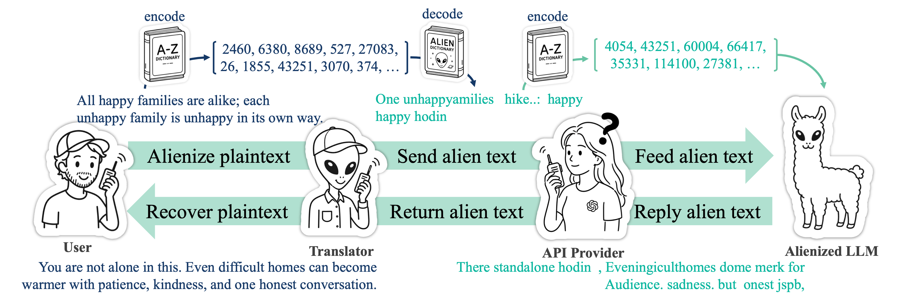

<div align="center">


# AlienLM

### Alienization of Language for API-Boundary Privacy in Black-Box LLMs

**Jaehee Kim** · **Pilsung Kang**

[📄 Paper](https://arxiv.org/abs/2601.22710) ·
[🌐 Project Page](https://kimjaehee0725.github.io/AlienLM/) ·
[🤗 Models](https://huggingface.co/collections/dsba-lab/alienlm) ·
[🤗 Llama 3 Full Alien](https://huggingface.co/dsba-lab/llama3-8b-instruct-alienlm-full) ·
[🧪 Recovery Evals](https://github.com/KimJaehee0725/AlienLM-recovery-evals) ·
[💻 Code](https://github.com/KimJaehee0725/AlienLM)

</div>

---

<p align="center">
  
</p>

**AlienLM** is a client-side privacy layer for black-box LLM APIs. It translates
natural text into an *Alien Language* through a vocabulary-scale token bijection,
adapts the target model with Alien Adaptation Training (AAT), and recovers the
model output back into natural language on the client side.

This `main` branch is the lightweight entrypoint for AlienLM tokenizer
initialization and translation utilities. For the full ICML 2026 experiment
snapshot, including tokenizer assets, Axolotl configs, and evaluation launchers,
use the [`icml`](https://github.com/KimJaehee0725/AlienLM/tree/icml) branch.

---

## News and Resources

- 📄 **Paper**: [arXiv:2601.22710](https://arxiv.org/abs/2601.22710)
- 🌐 **Project page**: [kimjaehee0725.github.io/AlienLM](https://kimjaehee0725.github.io/AlienLM/)
- 🤗 **Model collection**: [dsba-lab/AlienLM](https://huggingface.co/collections/dsba-lab/alienlm)
- 🤗 **Llama 3 Full Alien checkpoint**: [dsba-lab/llama3-8b-instruct-alienlm-full](https://huggingface.co/dsba-lab/llama3-8b-instruct-alienlm-full)
- 🧪 **Recovery evaluations**: [KimJaehee0725/AlienLM-recovery-evals](https://github.com/KimJaehee0725/AlienLM-recovery-evals)
- 💻 **Official code**: [KimJaehee0725/AlienLM](https://github.com/KimJaehee0725/AlienLM)

## Branches

| Branch | Purpose |
| --- | --- |
| `main` | Minimal, stable entrypoint for tokenizer initialization and translation |
| `icml` | ICML 2026 paper artifact snapshot with assets, training configs, and evaluation launchers |

The `main` branch intentionally excludes checkpoints, raw evaluation dumps,
dataset caches, W&B runs, and large experiment-only files. Recovery and
robustness experiments are maintained separately in
[AlienLM-recovery-evals](https://github.com/KimJaehee0725/AlienLM-recovery-evals).

## Components

| Component | What it is for | Start here |
| --- | --- | --- |
| Translator | Lossless text conversion between original and alien tokenizers | `translator/translator.py` |
| Tokenizer initialization | Token matching and randomized token reordering utilities | `tokenizer/token_init/` |
| Smoke checks | Small local checks that do not require paper-scale compute | `scripts/smoke/` |
| Paper artifacts | Tokenizer assets, AAT configs, and evaluation launchers | [`icml` branch](https://github.com/KimJaehee0725/AlienLM/tree/icml) |


## Install

The recommended setup uses [`uv`](https://docs.astral.sh/uv/). Run all commands
from the repository root.

```bash
git clone https://github.com/KimJaehee0725/AlienLM.git
cd AlienLM
uv sync
```

Install optional dependencies when constructing alien token orderings:

```bash
uv sync --extra init --extra freq
```

For gated Llama-family tokenizers or checkpoints, log in to Hugging Face first:

```bash
uvx --from huggingface_hub huggingface-cli login
```

## Quick Start: Translate Text

`TokenizerTranslator` converts text by preserving token IDs and swapping which
tokenizer decodes those IDs.

- `plain2alien`: encode with the original tokenizer, decode with the alien tokenizer
- `alien2plain`: encode with the alien tokenizer, decode with the original tokenizer

Download the tokenizer files for the Llama 3 Full Alien checkpoint:

```bash
mkdir -p assets/llama3-8b-instruct-alienlm-full

uvx --from huggingface_hub huggingface-cli download \
  dsba-lab/llama3-8b-instruct-alienlm-full \
  tokenizer.json tokenizer_config.json special_tokens_map.json \
  --local-dir assets/llama3-8b-instruct-alienlm-full
```

Then translate a sentence:

```python
from pathlib import Path

from translator import TokenizerTranslator

translator = TokenizerTranslator(
    alien_tokenizer_path=str(
        Path("assets/llama3-8b-instruct-alienlm-full").resolve()
    ),
    opensource_tokenizer="meta-llama/Meta-Llama-3-8B-Instruct",
)

plain = "All happy families are alike; each unhappy family is unhappy in its own way."
alien = translator.plain2alien(plain)
restored = translator.alien2plain(alien)

print("plain:", plain)
print("alien:", alien)
print("restored:", restored)
assert restored == plain
```

For the Llama 3 Full Alien example above, the translation output follows the
model card:

```text
Natural text
All happy families are alike; each unhappy family is unhappy in its own way.

Alien text
One unhappyamilies
 hike..:
 happy
                                                                        happy hodin                                                                                                             waypoints,

Original token IDs
[2460, 6380, 8689, 527, 27083, 26, 1855, 43251, 3070, 374, 43251, 304, 1202, 1866, 1648, 13]

Alien token IDs
[4054, 43251, 60004, 66417, 35331, 114100, 27381, 6380, 39185, 23136, 6380, 109132, 8299, 21649, 82386, 11]
```

The same translation can be run from the command line:

```bash
ALIEN_TOKENIZER="$(pwd)/assets/llama3-8b-instruct-alienlm-full"

uv run python translator/translator.py \
  --alien-tokenizer-path "$ALIEN_TOKENIZER" \
  --opensource-tokenizer meta-llama/Meta-Llama-3-8B-Instruct \
  --direction plain2alien \
  "All happy families are alike; each unhappy family is unhappy in its own way."
```

Run the dependency-light round-trip smoke test:

```bash
uv run python scripts/smoke/translator_roundtrip.py
```

## Initialize an Alien Tokenizer

AlienLM builds an alien tokenizer by matching and reordering token IDs while
keeping the base tokenizer's ID space compatible.

```bash
uv run python tokenizer/token_init/token_matching.py \
  --base_model meta-llama/Meta-Llama-3-8B-Instruct \
  --proxy_model Qwen/Qwen2.5-7B-Instruct \
  --token_freq_json /path/to/token_freq.json \
  --output matches-sim-and-diff.txt
```

For randomized bucket reordering, use:

```bash
uv run python tokenizer/token_init/token_random.py --help
```

The full paper snapshot on the `icml` branch includes additional tokenizer
assets and experiment launchers.

## Layout

- `tokenizer/token_init/`: alien language initialization utilities
- `translator/`: original-tokenizer to alien-tokenizer text translation
- `scripts/smoke/`: lightweight local smoke checks

## Citation

If AlienLM helps your research, please consider citing:

```bibtex
@inproceedings{kim2026alienlm,
  title={AlienLM: Alienization of Language for API-Boundary Privacy in Black-Box LLMs},
  author={Kim, Jaehee and Kang, Pilsung},
  booktitle={Proceedings of the 43rd International Conference on Machine Learning},
  year={2026}
}
```
